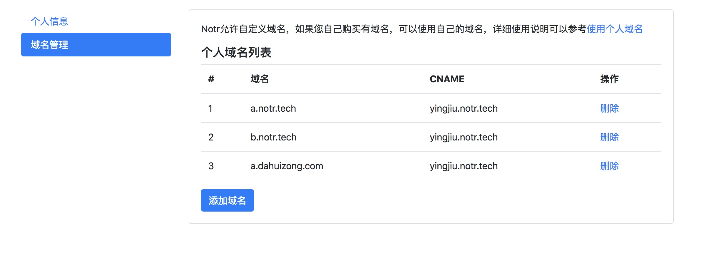
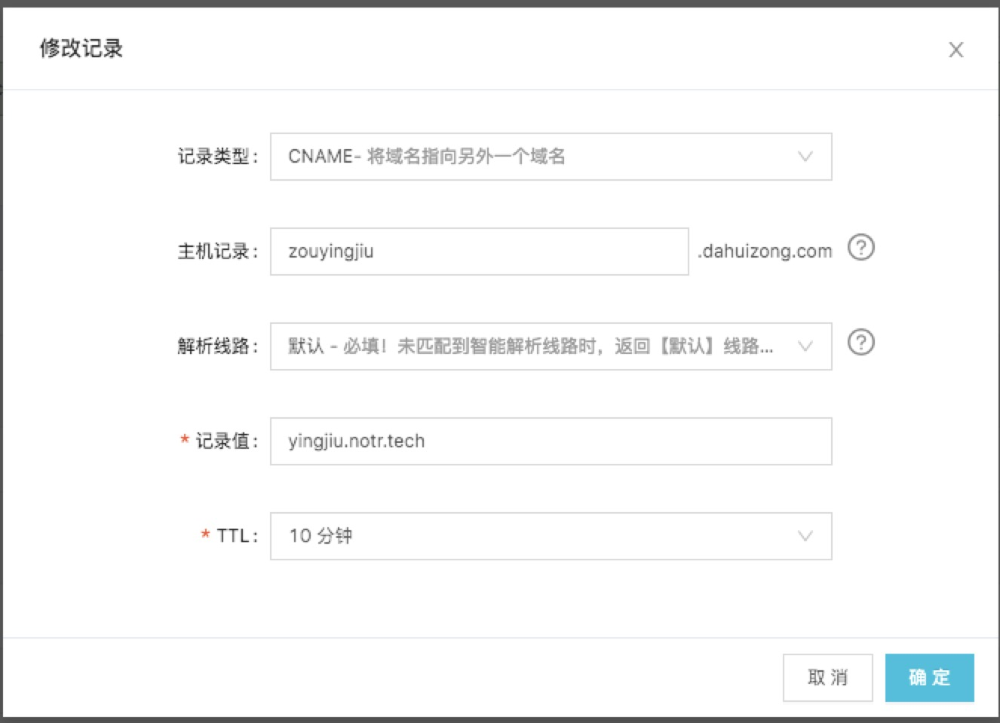

# 自定义域名

Notr会为每个注册用户生成Notr的二级域名，为了满足更多客户的需求，Notr也允许用户使用自己购买的域名，只需要通过2个步骤配置即可轻松使用。

1、在管理控制台添加个人域名

第一步需要在Notr的个人页面添加个人域名，** 每个用户最多只能添加3个个人域名。**




2、配置个人域名cname

假设个人希望使用zouyingjiu.dahuizong.com这一域名，注册之后，Notr为您提供的域名是yingjiu.notr.tech，那么您可以设置zouyingjiu.dahuizong.com的别名为yingjiu.notr.tech。设置成功之后，您就可以使用自己的zouyingjiu.dahuizong.com来作为自己的个人域名


以阿里云为例，在阿里云域名管理平台添加域名zouyingjiu.dahuizong.com的cname记录为yingjiu.notr.tech



设置完成之后为保证生效，可以使用```nslookup zouyingjiu.dahuizong.com```进行测试。

```

➜  ~ nslookup zouyingjiu.dahuizong.com
Server:		114.114.114.114
Address:	114.114.114.114#53

Non-authoritative answer:
zouyingjiu.dahuizong.com	canonical name = yingjiu.notr.tech.
Name:	yingjiu.notr.tech
Address: 120.25.214.63

```

最后，**如果您已经运行了Notr客户端，您需要重启您的客户端让新的域名生效。**