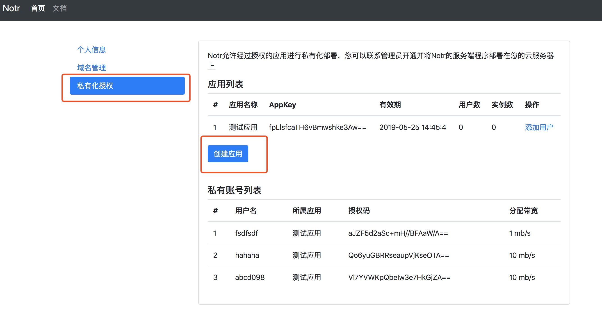
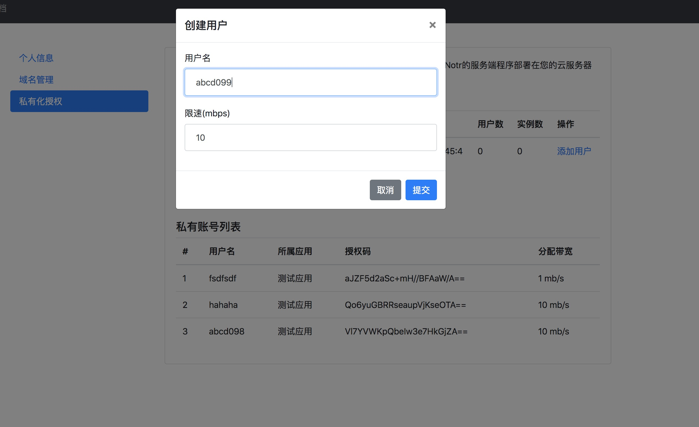

# 私有化部署
Notr支持授权用户将Notr的服务器程序部署在自身购买的云服务器上，授权用户可以进行私有账号管理。
授权用户通过以下步骤即可私有化部署Notr：

1、在控制面板创建一个应用

2、联系管理员开通授权license

应用创建成功之后，需要找管理员开通license并将软件部署在云服务器上，可以通过点击[联系管理员](zh-cn/contact)获得我们的联系方式。

3、添加私有用户
应用部署就绪之后，就可以进行私有用户添加

用户添加成功之后，通过用户的授权码即可使用notr，notr后台会根据您创建的用户的授权码返回您的私有服务器给客户端进行接入。