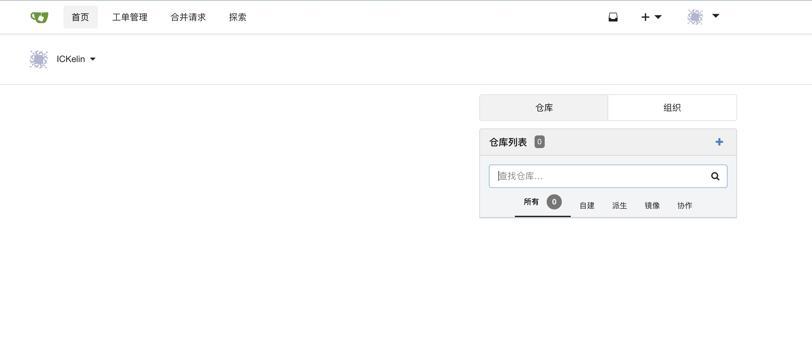

# 使用Notr发布应用

应用发布是Notr最基本的功能，Notr具备短线重连的机制，可以使用Notr来发布测试版本，也可以发布正式版本的应用程序，发布应用时，只需要像平时测试当中一样，运行服务，然后运行Notr客户端，即可通过客户端生成的域名访问本地服务，无需购买域名，无需购买云服务器，也无需解决环境的不一致问题。

如果你是开发者，你肯定经历过以下情况：首先在本地自测，没发现问题，然后兴致勃勃的申请云服务器，搭建运行环境，安装需要依赖的库，工具，接着打包应用程序，发布到云服务器，接下来交由测试人员进行测试，测试发现有问题，可能是环境的问题，这时候需要花时间修复，修复完之后测试发现需要进行某些调整，然后您又需要迭代上述过程，直到测试通过。那么，使用Notr之后，事情就会简单很多，您只需要在本机运行程序（我们相信您肯定对自己的开发环境非常熟悉了），然后运行Notr，告诉测试人员去测试，或者跟产品经理进行阶段性沟通。

在Notr开始阶段，我们发布了一些应用，可以当成参考的应用场景

## 使用Notr发布2048游戏
[2048](http://guid.notr.tech)

## 使用Notr发布gitea应用

[Gitea](https://github.com/go-gitea/gitea) 是一个开源社区驱动的 Gogs 克隆, 是一个轻量级的代码托管解决方案，后端采用 Go 编写，采用 MIT 许可证.

[发布的gitea](http://gitea.notr.tech)

## 使用Notr发布从voa网站上爬取的科技新闻列表

[voavoa](http://voavoa.notr.tech)

